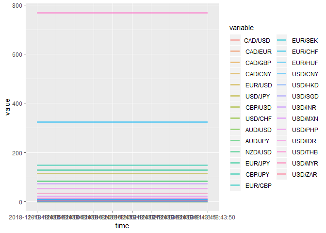

``` r
url_crypto <-"https://ca.finance.yahoo.com/cryptocurrencies"
url_commo <- "https://ca.finance.yahoo.com/commodities"
url_curr <- "https://ca.finance.yahoo.com/currencies"
i = 0 
currency_price <- data.frame()
time_list <- c()
while (i < 10){
  web_page_parsed <- htmlParse(GET(url_curr), encoding = "UTF-8")
  table <- readHTMLTable(web_page_parsed)
  table <- table[[1]][,1:3]
  names(table) <- c("Symb","Name","price")
  price_list <-as.numeric(strsplit(toString(table$price),",")[[1]])[1:28]
  name_list <- strsplit(toString(table$Name),",")[[1]][1:28]
  # names(price_list) <- name_list
  currency_price <- rbind(currency_price,price_list)
  colnames(currency_price) <- name_list
  time_list <- c(time_list,toString(Sys.time()))
  Sys.sleep(5)
  i = i + 1
}
currency_price$time <- time_list
print(head(currency_price))
```

    ##   CAD/USD  CAD/EUR  CAD/GBP  CAD/CNY  EUR/USD  USD/JPY  GBP/USD  USD/CHF
    ## 1    0.76     0.67   0.5802   5.2531   1.1305  113.873  1.30130  1.00642
    ## 2    0.76     0.67   0.5802   5.2531   1.1305  113.873  1.30130  1.00642
    ## 3    0.76     0.67   0.5802   5.2531   1.1305  113.878  1.30134  1.00646
    ## 4    0.76     0.67   0.5802   5.2531   1.1305  113.879  1.30134  1.00646
    ## 5    0.76     0.67   0.5802   5.2531   1.1305  113.872  1.30134  1.00646
    ## 6    0.76     0.67   0.5802   5.2531   1.1305  113.879  1.30134  1.00646
    ##    AUD/USD  AUD/JPY  NZD/USD  EUR/JPY  GBP/JPY  EUR/GBP  EUR/SEK  EUR/CHF
    ## 1   0.7219   82.193   0.6773  128.688  148.161  0.86843 10.22370  1.13737
    ## 2   0.7219   82.193   0.6773  128.688  148.161  0.86843 10.22370  1.13737
    ## 3   0.7219   82.189   0.6773  128.705  148.180  0.86851 10.22354  1.13747
    ## 4   0.7219   82.194   0.6773  128.704  148.178  0.86850 10.22356  1.13747
    ## 5   0.7219   82.192   0.6773  128.703  148.178  0.86850 10.22342  1.13747
    ## 6   0.7219   82.197   0.6773  128.703  148.173  0.86852 10.22342  1.13747
    ##    EUR/HUF  EUR/JPY  USD/CNY  USD/HKD  USD/SGD  USD/INR  USD/MXN  USD/PHP
    ## 1   322.90  128.688   6.9518  7.83278  1.37997     72.3  20.4940    53.05
    ## 2   322.90  128.688   6.9518  7.83278  1.37997     72.3  20.4940    53.05
    ## 3   322.90  128.705   6.9519  7.83278  1.38022     72.3  20.4940    53.05
    ## 4   322.90  128.704   6.9519  7.83278  1.37998     72.3  20.4940    53.05
    ## 5   322.88  128.703   6.9519  7.83278  1.38020     72.3  20.4889    53.05
    ## 6   322.88  128.703   6.9519  7.83278  1.38020     72.3  20.4940    53.05
    ##    USD/IDR  USD/THB  USD/MYR  USD/ZAR                time
    ## 1       14      768   32.922     4.19 2018-11-13 18:42:58
    ## 2       14      768   32.922     4.19 2018-11-13 18:43:04
    ## 3       14      768   32.922     4.19 2018-11-13 18:43:10
    ## 4       14      768   32.922     4.19 2018-11-13 18:43:15
    ## 5       14      768   32.922     4.19 2018-11-13 18:43:21
    ## 6       14      768   32.922     4.19 2018-11-13 18:43:27

``` r
library(ggplot2)
```

    ## Warning: package 'ggplot2' was built under R version 3.5.1

``` r
library(reshape)
```

    ## Warning: package 'reshape' was built under R version 3.5.1

    ## 
    ## Attaching package: 'reshape'

    ## The following object is masked from 'package:dplyr':
    ## 
    ##     rename

``` r
price_plot <- melt(currency_price,"time")
ggplot2::ggplot(price_plot,aes(x = time, y = value, 
                                  group = variable, color = variable)) + geom_line(size = 1.2, alpha = 0.5) 
```



 
