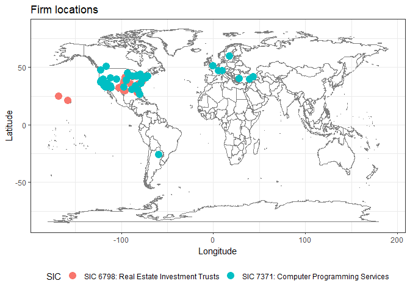

SEC firm locations
==================

This is an example of scraping location information of firms from the [SEC websites](https://www.sec.gov/edgar/searchedgar/companysearch.html).

We use rvest for scraping data of a HTML page given the node name.

The scraping is down recursively by extracting the firm's identifier through the search page(SIK) and create a url linked to the firm's web page indexed by the firm's identifier.

The doccumentation of R vest file: [Rvest Documentation](https://cran.r-project.org/web/packages/rvest/rvest.pdf)

The ggmap is used for extracting the longitude and latitude information given a string containing the address.

The documentation of ggmap: [ggmap Documentation](https://cran.r-project.org/web/packages/ggmap/ggmap.pdf)

Other than that, the natural language processing is done using tm and stringr.

``` r
for (pkg in c("rvest","httr","dplyr","stringr","XML","RCurl","ggplot2","reshape","tm","ggmap")){
 if (!pkg %in% rownames(installed.packages())){install.packages(pkg)}
}
library(rvest)
library(dplyr)
library(stringr)
library(ggmap)
library(XML)
library(httr)
library(tm)
```

Getting firm addresses from SEC website
---------------------------------------

The SIC code for industries are available for lookup: [SIC code lookup](https://www.sec.gov/info/edgar/siccodes.htm)

Could be intersting industries:

-   6500: REAL ESTATE

-   6798: Real Estate Investment Trusts

-   7371: Computer Programming Services

We analyze the following industries:

-   1400: MINING & QUARRYING OF NONMETALLIC MINERALS (NO FUELS)

-   5734: RETAIL-COMPUTER & COMPUTER SOFTWARE STORES

``` r
SIC.CODES <- c(1400, 5734)
SIC.NAMES <- c("SIC 1400:Mining ","SIC 5734:Retail computer")
```

Define a function that searches all firms in a given industry from the SEC website:

``` r
MAX.PAGE <- 2 # maximum number of pages to be read (each page contains 100 firms)

ConstructFirmDF <- function(sic) {
  i <- 0
  continue_indic = TRUE #always continue to search
  firm.df <- data.frame(firm_code=character(),compnay=character(),state=character())
  # Create an empty data frame to store information, The data frame contains three columns:
    # firm_code: stores the CIK
    # company  : company name
    # state    : the state of operation
  while (continue_indic){
    search_url <- paste('https://www.sec.gov/cgi-bin/browse-edgar?',
                      'action=getcompany&SIC=',sic,
                      '&owner=exclude&match=&start=',i*100,'&count=100&hidefilings=0',
                      sep="") #paste the sic code(for industry) into the search engine
  
    search_info <- GET(search_url) #fetch the html file
    parsed_search <- htmlParse(search_info) #use html Parser
    info <- try( data.frame(readHTMLTable(parsed_search)),TRUE) 
    # If the page has an empty table, it means we reach the end of the search
    # The info will contain a string fetched from the HTML file
    i <- i+1 #Search for next 100 records
    if (typeof(info) != "list"|| (i > MAX.PAGE)||dim(info)[1] == 0 ) {
      break #If the info returns text, stop searching
    }
    names(info) <- c("firm_code","company","state") #Rename the list to match the column names
    firm.df <- rbind(firm.df,info) #Merge the search results with the large data frame
  }
  
  return (firm.df)
}#End of ConstructFirmDF


firm.df.1 <- ConstructFirmDF(SIC.CODES[1]) #Search for 100 records for firm 1
```

    ## No encoding supplied: defaulting to UTF-8.
    ## No encoding supplied: defaulting to UTF-8.
    ## No encoding supplied: defaulting to UTF-8.

``` r
firm.df.2 <- ConstructFirmDF(SIC.CODES[2]) #Searcg for 100 records for firm 2
```

    ## No encoding supplied: defaulting to UTF-8.
    ## No encoding supplied: defaulting to UTF-8.

``` r
print(head(firm.df.1))
```

    ##    firm_code                         company state
    ## 1 0001084477               ADAMSON RICHARD G    NC
    ## 2 0001164704          ALBERTA EXPLORATION CO    A0
    ## 3 0001238176   ALBERTA STAR DEVELOPMENT CORP    A1
    ## 4 0000813621        AMCOL INTERNATIONAL CORP    IL
    ## 5 0001062493     AMERICAN BENEFITS GROUP INC    FL
    ## 6 0000225255 AMERICAN RESOURCES GROUP INC/CO    CO

``` r
print(head(firm.df.2))
```

    ##    firm_code                     company state
    ## 1 0000833443                BABBAGES INC    TX
    ## 2 0001537689         Comp Services, Inc.    CA
    ## 3 0001084954               COMPGEEKS INC    CA
    ## 4 0000880323                 COMPUSA INC    TX
    ## 5 0001103833 Crown Equity Holdings, Inc.    NV
    ## 6 0001041712        CYBERIAN OUTPOST INC    CT

For each individual firm, find the location in the firm's home page.

``` r
GetLocation <- function(firm_code){
  url <- paste('https://www.sec.gov/cgi-bin/browse-edgar?action=getcompany&CIK=',
               firm_code,'&owner=include&count=40&hidefilings=0',sep = "")
  firm_page <- read_html(url)
  addr_str <- firm_page %>% html_nodes(".mailer") %>% html_text() 
  mail_addr <- addr_str[1] %>% strsplit("\n") 
  mail_addr <- mail_addr[[1]][-1] %>% str_trim() %>% str_c(collapse = "\n")
  
  # The first element is buisness address, the second is the mailing address
  return(mail_addr)
}

firm.df.1$address <- sapply(firm.df.1$firm_code, GetLocation)
firm.df.2$address <- sapply(firm.df.2$firm_code, GetLocation)

print(head(firm.df.1))
```

    ##    firm_code                         company state
    ## 1 0001084477               ADAMSON RICHARD G    NC
    ## 2 0001164704          ALBERTA EXPLORATION CO    A0
    ## 3 0001238176   ALBERTA STAR DEVELOPMENT CORP    A1
    ## 4 0000813621        AMCOL INTERNATIONAL CORP    IL
    ## 5 0001062493     AMERICAN BENEFITS GROUP INC    FL
    ## 6 0000225255 AMERICAN RESOURCES GROUP INC/CO    CO
    ##                                                                  address
    ## 1 MARTIN MARIETTA MATERIALS INC\n2710 WYCLIFF ROAD\n\nRALEIGH NC 27607\n
    ## 2            15 APPLEBROOK CIRCLE SE\n\nCALGARY ALBERTA CANA A0 T2A7S5\n
    ## 3            675 WEST HASTING STE 200\n\nVANCOUVER BC CANADA A1 V6B1N2\n
    ## 4                        2870 FORBS AVENUE\n\nHOFFMAN ESTATES IL 60192\n
    ## 5                 10 FAIRWAY DR\nSUITE 307\n\nDEERFIELD BEACH FL 33441\n
    ## 6

``` r
print(head(firm.df.2))
```

    ##    firm_code                     company state
    ## 1 0000833443                BABBAGES INC    TX
    ## 2 0001537689         Comp Services, Inc.    CA
    ## 3 0001084954               COMPGEEKS INC    CA
    ## 4 0000880323                 COMPUSA INC    TX
    ## 5 0001103833 Crown Equity Holdings, Inc.    NV
    ## 6 0001041712        CYBERIAN OUTPOST INC    CT
    ##                                            address
    ## 1       10741 KING WILLIAM DR\n\nDALLAS TX 75220\n
    ## 2    1100 PEDRAS ROAD\n#B122\n\nTURLOCK CA 95382\n
    ## 3                                                 
    ## 4     14951 NORTH DALLAS PKWY\n\nDALLAS TX 75240\n
    ## 5 11226 PENTLAND DOWNS ST.\n\nLAS VEGAS NV 89146\n
    ## 6 27 NORTH MAIN ST\nP O BOX 636\n\nKENT CT 06757\n

Getting location
----------------

It turns out that company addresses are not sufficient for plotting -- we need geographical locations in terms of latitude and longitude as well. One good news is that `ggmap` can handle this pretty well. Construct the following function that returns the address given an addresss string:

``` r
GetGeocode <- function (address) {
  geocode(address, source = "dsk") # extract geocode using Data Science Toolkit
}
```

For instance, the geocode of company `BOREALIS TECHNOLOGY CORP` from `https://www.sec.gov/cgi-bin/browse-edgar?action=getcompany&CIK=0001014767&owner=include&count=40&hidefilings=0` can be found by passing their business address:

``` r
address <- "4070 SILVER SAGE DR\nSTE 211\nCARSON CITY NV 89701" #Demo address
GetGeocode(address) #The geo location info from the demo address
```

    ## Information from URL : http://www.datasciencetoolkit.org/maps/api/geocode/json?address=4070%20SILVER%20SAGE%20DR%0ASTE%20211%0ACARSON%20CITY%20NV%2089701&sensor=false

    ##         lon      lat
    ## 1 -119.7636 39.13062

where `lon` and `lat` indicate its longitude and latitude respectively.

### Multiple locations

Getting multiple locations can be done by using `lapply` function:

``` r
firm.df.1.locations <- lapply(firm.df.1$address, GetGeocode) #Get all the longtitude and latitude 
```

    ## Warning: geocode failed with status ZERO_RESULTS, location = "675 WEST HASTING STE 200
    ## 
    ## VANCOUVER BC CANADA A1 V6B1N2
    ## "

    ## Warning: geocode failed with status ZERO_RESULTS, location = "835-1100 MELVILLE STREET
    ## 
    ## VANCOUVER A1 V6E 4A6
    ## "

    ## Warning: geocode failed with status ZERO_RESULTS, location = "680 - 1066 WEST HASTINGS STREET
    ## 
    ## VANCOUVER A1 V6E 3X2
    ## "

    ## Warning: geocode failed with status ZERO_RESULTS, location = "405-555 SIXTH STREET
    ## 
    ## NEW WESTMINSTER BC A1 V3L 5H1
    ## "

    ## Warning: geocode failed with status ZERO_RESULTS, location = "SUITE 2600, THREE BENTALL CENTRE
    ## P.O. BOX 49314, 595 BURRARD STREET
    ## 
    ## VANCOUVER A1 V7X 1L3
    ## "

    ## Warning: geocode failed with status ZERO_RESULTS, location = "#6 HARSTON AVENUE
    ## MOSMAN
    ## 
    ## SYDNEY C3 2088
    ## "

    ## Warning: geocode failed with status ZERO_RESULTS, location = "1430 - 800 WEST PENDER ST.
    ## 
    ## VANCOUVER, B.C. A1 V6C 2V6
    ## "

    ## Warning: geocode failed with status ZERO_RESULTS, location = "SUITE 300, BOW VALLEY SQUARE 4
    ## 250 SIXTH AVENUE SW
    ## 
    ## CALGARY ALBERTA A0 T2P 3H7
    ## "

    ## Warning: geocode failed with status ZERO_RESULTS, location = "7425 ARBUTUS STREET
    ## 
    ## VANCOUVER A1 V6P5T2
    ## "

    ## Warning: geocode failed with status ZERO_RESULTS, location = "14727-129 STREET
    ## 
    ## EDMONTON A0 T6V 1C4
    ## "

    ## Warning: geocode failed with status ZERO_RESULTS, location = "14TH FLOOR 400 BURRARD STREET
    ## V6C 3G2
    ## 
    ## VANCOUVER BC A1 V6C 3G2
    ## "

    ## Warning: geocode failed with status ZERO_RESULTS, location = "SUITE 413
    ## 595 BURRARD STREET
    ## 
    ## VANCOUVER A1 V7X 1J1
    ## "

    ## Warning: geocode failed with status ZERO_RESULTS, location = "SUITE 1240
    ## 1140 WEST PENDER STREET
    ## 
    ## VANCOUVER A1 V6E 4G1
    ## "

    ## Warning: geocode failed with status ZERO_RESULTS, location = "905 WEST PENDER STREET
    ## SUITE 200
    ## 
    ## VANCOUVER A1 V6C 1L6
    ## "

    ## Warning: geocode failed with status ZERO_RESULTS, location = "SUITE 2100 1177 WEST HASTINGS STREET
    ## 
    ## VANCOUVER A1 V6E 2K3
    ## "

    ## Warning: geocode failed with status ZERO_RESULTS, location = "32603 FLEMING AVENUE
    ## 
    ## MISSION A1 V2V 2G8
    ## "

    ## Warning: geocode failed with status ZERO_RESULTS, location = "1111 MELVILLE STREET, SUITE 1100
    ## 
    ## VANCOUVER A1 V6E 3V6
    ## "

    ## Warning: geocode failed with status ZERO_RESULTS, location = "250 EAST FIFTH STREET
    ## 15 FLOOR PMB #121
    ## 
    ## CINCINNATI OH 45202
    ## "

    ## Warning: geocode failed with status ZERO_RESULTS, location = "10655 NE 4TH STREET #400
    ## 
    ## BELLEVUE WA 98004
    ## "

    ## Warning: geocode failed with status ZERO_RESULTS, location = "200 BURRARD STREET, SUITE 650
    ## 
    ## VANCOUVER A1 V6C 3L6
    ## "

    ## Warning: geocode failed with status ZERO_RESULTS, location = "601 WEST BROADWAY SUITE U13
    ## V5Z 4C2
    ## 
    ## VANCOUVER BC
    ## "

    ## Warning: geocode failed with status ZERO_RESULTS, location = "SUITE 1238
    ## 200 GRANVILLE STREET
    ## 
    ## VANCOUVER A1 V6C 1S4
    ## "

    ## Warning: geocode failed with status ZERO_RESULTS, location = "SUITE 614
    ## 475 HOWE STREET
    ## 
    ## VANCOUVER A1 V6C 2B3
    ## "

    ## Warning: geocode failed with status ZERO_RESULTS, location = "FLORASTRASSE 14
    ## 
    ## ZURICH V8 CH-8008
    ## "

    ## Warning: geocode failed with status ZERO_RESULTS, location = "SUITE 1400
    ## 400 BURRARD STREET
    ## 
    ## VANCOUVER A1 V6C 3A6
    ## "

    ## Warning: geocode failed with status ZERO_RESULTS, location = "2393-,595 BURRARD ST
    ## 
    ## VANCOUVER A1 V7X 1K8
    ## "

    ## Warning: geocode failed with status ZERO_RESULTS, location = "SUITE 1660
    ## 999 WEST HASTINGS STREET
    ## 
    ## VANCOUVER A1 V6C 2W2
    ## "

    ## Warning: geocode failed with status ZERO_RESULTS, location = "800 WEST PENDER STREET
    ## SUITE 423
    ## 
    ## VANCOUVER A1 V6C 2V6
    ## "

    ## Warning: geocode failed with status ZERO_RESULTS, location = "3123 - 595 BURRARD STREET
    ## 
    ## VANCOUVER A1 V7X 1J1
    ## "

    ## Warning: geocode failed with status ZERO_RESULTS, location = "SUITE 1650
    ## 1055 WEST HASTINGS STREET
    ## 
    ## VANCOUVER A1 V6E 2E9
    ## "

    ## Warning: geocode failed with status ZERO_RESULTS, location = "SUITE 750, 625 HOWE ST.
    ## 
    ## VANCOUVER A1 V6C 2T6
    ## "

    ## Warning: geocode failed with status ZERO_RESULTS, location = "SUITE 610
    ## 815 WEST HASTINGS STREET
    ## 
    ## VANCOUVER A1 V6C 1B4
    ## "

    ## Warning: geocode failed with status ZERO_RESULTS, location = "HAIWANG STREET, YANGZI AVENUE
    ## COASTAL ECONOMIC ZONE
    ## 
    ## WEIFANG CITY, SHANDONG PROVINC F4 430010
    ## "

    ## Warning: geocode failed with status ZERO_RESULTS, location = "413 19TH STREET #223
    ## 
    ## LYNDEN WA 98264
    ## "

    ## Warning: geocode failed with status ZERO_RESULTS, location = "3045 SOUTHCREEK ROAD
    ## UNIT 15A
    ## 
    ## MISSISSAUGA A6 L4X 2E9
    ## "

    ## Warning: geocode failed with status ZERO_RESULTS, location = "SUITE 220
    ## 1010 - 1ST STREET S.W.
    ## 
    ## CALGARY A0 T2R 1K4
    ## "

    ## Warning: geocode failed with status ZERO_RESULTS, location = "PO BOX 95012
    ## 8726 BARNARD ST VANCOUVER BC V6P6V4
    ## "

    ## Warning: geocode failed with status ZERO_RESULTS, location = "SUITE 1640 - 1066 WEST HASTINGS STREET
    ## BOX 12543
    ## 
    ## VANCOUVER A1 V6E 3X1
    ## "

    ## Warning: geocode failed with status ZERO_RESULTS, location = "#162 - 2906 WEST BROADWAY
    ## 
    ## VANCOUVER A1 V6K 2G8
    ## "

    ## Warning: geocode failed with status ZERO_RESULTS, location = "215-800 WEST PENDER STREET
    ## 
    ## VANCOUVER A1 V6C 2V6
    ## "

    ## Warning: geocode failed with status ZERO_RESULTS, location = "SUITE 575
    ## 510 BURRARD STREET
    ## 
    ## VANCOUVER A1 V6C 3A8
    ## "

    ## Warning: geocode failed with status ZERO_RESULTS, location = "206 837 WEST HASTINGS ST
    ## 
    ## VANCOUVER BC CANADA A1 V6C3N6
    ## "

    ## Warning: geocode failed with status ZERO_RESULTS, location = "1859 SPYGLASS PLACE
    ## STE 414
    ## 
    ## VANCOUVER BRITISH CO A6 9999999
    ## "

    ## Warning: geocode failed with status ZERO_RESULTS, location = "400 FIFTH AVENUE SW
    ## SUITE 530
    ## 
    ## ALBERTA A7 00000
    ## "

    ## Warning: geocode failed with status ZERO_RESULTS, location = "MATIAS COUSI?O 82
    ## OFICINA 806
    ## 
    ## SANTIAGO F3 00000
    ## "

    ## Warning: geocode failed with status ZERO_RESULTS, location = "4448 PATTERDALE DRIVE
    ## 
    ## NORTH VANCOUVER A1 V7R 4L8
    ## "

    ## Warning: geocode failed with status ZERO_RESULTS, location = "347 BAY STREET
    ## SUITE 204
    ## 
    ## TORONTO A6 V7S 2A2
    ## "

    ## Warning: geocode failed with status ZERO_RESULTS, location = "402 - 121 RICHMOND STREET WEST
    ## 
    ## TORONTO A6 M5H 2K1
    ## "

    ## Warning: geocode failed with status ZERO_RESULTS, location = "1574 GULF RD. #1505
    ## 
    ## POINT ROBERTS WA 98281
    ## "

    ## Warning: geocode failed with status ZERO_RESULTS, location = "UNIT M2-3, LEVEL M2, THE VERTICAL PODIUM
    ## AVE 3, BANGSAR SOUTH, #8 JALAN KERINCHI
    ## 
    ## KUALA LUMPUR N8 59200
    ## "

    ## Warning: geocode failed with status ZERO_RESULTS, location = "141 ADELAIDE STREET WEST, SUITE 420
    ## 
    ## TORONTO A6 M5H3L5
    ## "

    ## Warning: geocode failed with status ZERO_RESULTS, location = "2000-1055 WEST HASTINGS ST
    ## 
    ## VANCOUVER BRITISH COLUMBIA A1 V6E2E9
    ## "

    ## Warning: geocode failed with status ZERO_RESULTS, location = "#709 - 837 W. HASTINGS STREET
    ## 
    ## VANCOUVER A1 V6C 3N6
    ## "

    ## Warning: geocode failed with status ZERO_RESULTS, location = "SUITE 608, 1199 WEST PENDER STREET
    ## 
    ## VANCOUVER A1 V6E 2R1
    ## "

    ## Warning: geocode failed with status ZERO_RESULTS, location = "LEVEL 9, BGC CENTRE, 28 THE ESPLANADE
    ## 
    ## PERTH WA C3 6000
    ## "

    ## Warning: geocode failed with status ZERO_RESULTS, location = "..
    ## 4655 MONCTON STREET
    ## 
    ## RICHMOND A1 V7E 3A8
    ## "

    ## Warning: geocode failed with status ZERO_RESULTS, location = "SUITE 3123-595 BURRARD ST.
    ## 
    ## VANCOUVER A1 V7X 1J1
    ## "

    ## Warning: geocode failed with status ZERO_RESULTS, location = "SUITE 300
    ## 224 - 4TH AVENUE
    ## 
    ## SOUTH SASKATOON A9 S7K5M5
    ## "

    ## Warning: geocode failed with status ZERO_RESULTS, location = "789 WEST PENDER STREET
    ## SUITE 1010
    ## 
    ## VANCOUVER A1 V6C 1H2
    ## "

    ## Warning in readLines(connect, warn = FALSE): cannot open URL 'http://
    ## www.datasciencetoolkit.org/maps/api/geocode/json?address=27%20ST.
    ## %20JAMES'S%20STREET%0A%0ALONDON%20X0%20SW1A%201HA%0A&sensor=false': HTTP
    ## status was '500 Internal Server Error'

    ## Warning in geocode(address, source = "dsk"):   geocoding failed for "27 ST. JAMES'S STREET
    ## 
    ## LONDON X0 SW1A 1HA
    ## ".
    ##   if accompanied by 500 Internal Server Error with using dsk, try google.

    ## Warning: geocode failed with status ZERO_RESULTS, location = "580 HORNBY, SUITE 750
    ## 
    ## VANCOUVER A1 V6C 3B6
    ## "

    ## Warning: geocode failed with status ZERO_RESULTS, location = "UNIT 520
    ## 409 GRANVILLE STREET
    ## 
    ## VANCOUVER  BC A1 V6C 1T2
    ## "

    ## Warning: geocode failed with status ZERO_RESULTS, location = "550 BURRARD ST
    ## SUITE 3300, BENTALL 5
    ## 
    ## VANCOUVER A1 V6C 0B3
    ## "

    ## Warning: geocode failed with status ZERO_RESULTS, location = "3RD FLOOR, 157 ALEXANDER STREET
    ## 
    ## VANCOUVER A1 V6A 1B8
    ## "

    ## Warning: geocode failed with status ZERO_RESULTS, location = "SUITE 1023, 10/F., OCEAN CENTRE
    ## 5 CANTON RD., TSIM SHA TSUI
    ## 
    ## KOWLOON K3 00000
    ## "

    ## Warning: geocode failed with status ZERO_RESULTS, location = "SUITE 502-815 HORNBY STREET
    ## VANCOUVER, BRITISH COLUMBIA
    ## 
    ## VANCOUVER, B.C. A1 V6Z 2E6
    ## "

    ## Warning: geocode failed with status ZERO_RESULTS, location = "SUITE 500, 926 - 5TH AVENUE S.W.
    ## 
    ## CALGARY A0 T2P 0N7
    ## "

``` r
firm.df.2.locations <- lapply(firm.df.2$address, GetGeocode)
```

    ## Warning: geocode failed with status ZERO_RESULTS, location = "1100 PEDRAS ROAD
    ## #B122
    ## 
    ## TURLOCK CA 95382
    ## "

``` r
print(head(firm.df.1.locations))
```

    ## [[1]]
    ##         lon      lat
    ## 1 -78.69467 35.81571
    ## 
    ## [[2]]
    ##       lon     lat
    ## 1 35.0724 39.8049
    ## 
    ## [[3]]
    ##   lon lat
    ## 1  NA  NA
    ## 
    ## [[4]]
    ##         lon      lat
    ## 1 -88.38199 41.86861
    ## 
    ## [[5]]
    ##         lon      lat
    ## 1 -80.11057 26.31859
    ## 
    ## [[6]]
    ##   lon lat
    ## 1  NA  NA

Note that some locations might not have been fetched due to errors (some addresses might not exist anymore). `lapply` performs broadcasting a given function (second parameter) to a vector (first parameter) and returns a list, which is why it is called *l*`apply`.

To extract longitudes and latitudes, one can call the followings.

``` r
firm.df.1.lons <- sapply(firm.df.1.locations, "[[", "lon") # extract lon elements from a list of lists
firm.df.1.lats <- sapply(firm.df.1.locations, "[[", "lat") # extract lat elements from a list of lists
firm.df.2.lons <- sapply(firm.df.2.locations, "[[", "lon") # extract lon elements from a list of lists
firm.df.2.lats <- sapply(firm.df.2.locations, "[[", "lat") # extract lat elements from a list of lists
location.df.1 <- data.frame(lon = firm.df.1.lons, lat = firm.df.1.lats)
location.df.2 <- data.frame(lon = firm.df.2.lons, lat = firm.df.2.lats)
```

Plotting locations
------------------

First, construct a combined `data.frame` for plot:

``` r
location.df.1$SIC <- SIC.NAMES[1]
location.df.2$SIC <- SIC.NAMES[2]

location.df <- rbind(location.df.1, location.df.2)
```

Plot:

``` r
USA.MAP <- map_data("state") # load USA map from ggmap
ggplot(location.df, aes(x=lon, y=lat, color=SIC)) + 
  borders("world", colour="gray50", fill="white") +
  # geom_map(data=USA.MAP, map=USA.MAP, # draw borders based on USA.MAP
  #         aes(long, lat, map_id=region),
  #         color="gray30", fill=NA) +
  geom_point(size=4) +
  labs(x = "Longitude", y = "Latitude", title = "Firm locations") +
  theme_bw() +
    theme(legend.position="bottom")
```

    ## Warning: Removed 87 rows containing missing values (geom_point).


