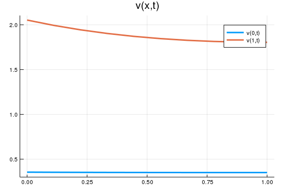

## About this document
Presented by Chiyoung Ahn (@chiyahn), written with `Weave.jl`.

~~~~{.julia}
using LinearAlgebra, Parameters, Plots, DifferentialEquations, SimpleDifferentialOperators
gr(fmt = :png); # save plots in .png
~~~~~~~~~~~~~

# Model
Consider solving $v(x,t)$ from the following PDE

$$
\rho v(x, t) = r(x, t) + \mu \partial_{x} v(x, t) + \frac{\sigma^2}{2} \partial_{xx} v(x, t) + \partial_{t} v(x, t)
$$

with $r(x,t) = x \exp(-t)$ for some constant $\mu < 0$, $\sigma > 0$ under boundary conditions in time dimension that $\partial_{t} v(x, T) = 0$ for all $x \in [0, 1]$. 
Also, we impose reflecting barrier conditions boundary in state dimension, i.e., $\partial_{x} v(0,t) = \partial_{x} v(1,t)$ for all $t \in [0, T]$. 

# Setup
## Payoff function
~~~~{.julia}
r(x,t) = x*exp(-t)
~~~~~~~~~~~~~

## Parameters
~~~~{.julia}
T = 1.0 # terminal time
μ = -0.1 # constant negative drift
σ = 0.1
ρ = 0.05
M = 20 # size of grid
x = range(0.0, 1.0, length = M) # grid
bc = (Reflecting(), Reflecting()) # boundary condition (reflecting barrier)
params = (μ = μ, σ = σ, ρ = ρ, x = x, bc = bc) # group them as a tuple
~~~~~~~~~~~~~

## Find `v` at `T`
~~~~{.julia}
L = μ*L₁₋(x, bc) + (σ^2 / 2) * L₂(x, bc)
vT = (I * ρ - L) \ r.(x,T); # v(x,T) under BC that v_t(x,T) = 0
~~~~~~~~~~~~~

## Define `dv` (partial derivative of `v` with respect to time)
~~~~{.julia}
function dv!(dv, v, params, t) 
    μ, σ, ρ, x, bc = params 
    # define discretized composition of differential operators w.r.t. x
    L = μ*L₁₋(x, bc) + (σ^2 / 2) * L₂(x, bc)
    dv[:] = (I * ρ - L) * v - r.(x,t)
end
~~~~~~~~~~~~~

~~~~
dv! (generic function with 1 method)
~~~~

## Define the corresponding ODE problem
~~~~{.julia}
prob = ODEProblem(dv!,vT,(T, 0.0),params)
~~~~~~~~~~~~~

# Results
## Compute the solution 
~~~~{.julia}
v = solve(prob)
@show v(0) # display v at time t = 0
~~~~~~~~~~~~~

~~~~
v(0) = [0.354547, 0.371188, 0.400922, 0.441669, 0.492209, 0.551855, 0.62017
6, 0.696874, 0.7817, 0.87443, 0.974837, 1.08267, 1.19764, 1.31932, 1.44705,
 1.57962, 1.71468, 1.84741, 1.9676, 2.05294]
20-element Array{Float64,1}:
 0.35454737560899113
 0.3711881911184714 
 0.4009216109860024 
 0.44166931822211575
 0.49220865221386606
 0.5518554420845276 
 0.620176282146123  
 0.6968735530744476 
 0.7816999014505823 
 0.8744299333231947 
 0.9748365282710391 
 1.082672995388287  
 1.1976402478933952 
 1.319322461861004  
 1.447051753983762  
 1.579622429305644  
 1.7146810868053521 
 1.8474091449602537 
 1.967595371755122  
 2.0529369925633563
~~~~

## Plots
~~~~{.julia}
v_x0(t) = v(t)[1]
v_x1(t) = v(t)[end]
ts = range(0, T, length = 10)
plot(range(0, T, length = 10), [v_x0; v_x1],  
    label = ["v(0,t)", "v(1,t)"] ,
    title = "v(x,t)", lw = 3)
~~~~~~~~~~~~~

\ 

