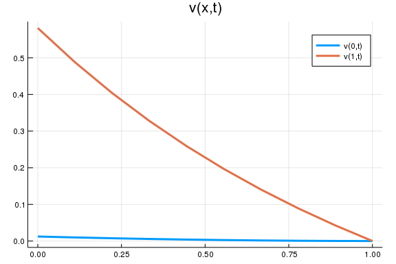

## About this document
Presented by Chiyoung Ahn (@chiyahn), written with `Weave.jl`.

~~~~{.julia}
using LinearAlgebra, Parameters, Plots, DifferentialEquations, SimpleDifferentialOperators
gr(fmt = :png); # save plots in .png
~~~~~~~~~~~~~

# Model
Consider solving $v(x,t)$ from the following PDE

$$
\rho v(x, t) = r(x, t) + \mu \partial_x v(x, t) + \frac{\sigma^2}{2} \partial_{xx} v(x, t) + \partial_{t} v(x, t)
$$

with $r(x,t) = x \exp(-t) $ for some constant $\mu < 0$, $\sigma > 0$ under boundary conditions in time dimension that $v(x, T) = 0$ for all $x \in [0, 1]$. 
Also, we impose reflecting barrier conditions boundary in state dimension, i.e., $v'(0,t) = v'(1,t)$ for all $t \in [0, T]$. 

# Setup
## Payoff function
~~~~{.julia}
r(x,t) = x*exp(-t)
~~~~~~~~~~~~~

## Parameters
~~~~{.julia}
T = 1.0 # terminal time
μ = -0.1 # constant negative drift
σ = 0.1
ρ = 0.05
M = 20 # size of grid
x = range(0.0, 1.0, length = M) # grid
bc = (Reflecting(), Reflecting()) # boundary condition (reflecting barrier)
params = (μ = μ, σ = σ, ρ = ρ, x = x, bc = bc) # group them as a tuple
~~~~~~~~~~~~~

## Define `dv` (partial derivative of `v` with respect to time)
~~~~{.julia}
function dv!(dv, v, params, t) 
    μ, σ, ρ, x, bc = params 
    # define discretized composition of differential operators w.r.t. x
    L = μ*L₁₋(x, bc) + (σ^2 / 2) * L₂(x, bc)
    dv[:] = (I * ρ - L) * v - r.(x,t)
end
~~~~~~~~~~~~~

~~~~
dv! (generic function with 1 method)
~~~~

## Define the corresponding ODE problem
~~~~{.julia}
dv0 = zeros(M) # defines v(x,0) for BC in time dimension
prob = ODEProblem(dv!,dv0,(T, 0.0),params)
~~~~~~~~~~~~~

# Results
## Compute the solution 
~~~~{.julia}
v = solve(prob)
@show v(0) # display v at time t = 0
~~~~~~~~~~~~~

~~~~
v(0) = [0.0123015, 0.0261141, 0.0485734, 0.0760849, 0.106319, 0.137899, 0.1
70087, 0.202527, 0.235063, 0.267632, 0.300212, 0.332796, 0.36538, 0.397963,
 0.430542, 0.463099, 0.495552, 0.52755, 0.557731, 0.58117]
20-element Array{Float64,1}:
 0.012301474179088685
 0.02611408785006977 
 0.048573360575907255
 0.07608490322439868 
 0.10631924770742279 
 0.137899065942069   
 0.17008721416966616 
 0.20252721239352856 
 0.23506292493770956 
 0.2676321492973393  
 0.30021222392056546 
 0.33279554254277127 
 0.36537964509181164 
 0.39796320097050775 
 0.430542457326533   
 0.46309945319873935 
 0.4955516330254107  
 0.5275496170090699  
 0.5577310129305776  
 0.5811702728941271
~~~~

## Plots
~~~~{.julia}
v_x0(t) = v(t)[1]
v_x1(t) = v(t)[end]
ts = range(0, T, length = 10)
plot(range(0, T, length = 10), [v_x0; v_x1],  
    label = ["v(0,t)", "v(1,t)"] ,
    title = "v(x,t)", lw = 3)
~~~~~~~~~~~~~

\ 

