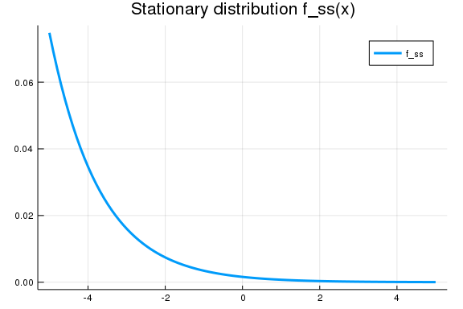
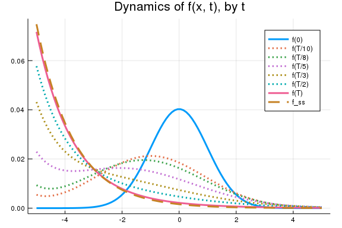

### About this document
Presented by Chiyoung Ahn (@chiyahn), written with `Weave.jl`.

~~~~{.julia}
using SimpleDifferentialOperators, LinearAlgebra, Plots, NLsolve, DifferentialEquations, Test
gr(fmt = :png); # save plots in .png
~~~~~~~~~~~~~

## Model
Consider the following diffusion process:

$$
dx = \mu dt + \sigma dW
$$

Let $f(x,t)$ be the density of $x$ at time $t$. Given an initial distribution of $f_0(x) = f_0(x,t)$, $f$ satisfies the following PDE by the Kolmogorov Forward Equation:

$$
\partial_{t} f(x,t) = - \mu \partial_{x} f(x,t) + \frac{1}{2} \sigma^2  \partial_{x x} f(x,t)
$$

## Setup
### Model
~~~~{.julia}
T = 100.0 # terminal time
μ = -0.1 # constant negative drift
σ = 0.5
M = 100 # size of grid
x = range(-5.0, 5.0, length = M) # grid
bc = (Reflecting(), Reflecting())
params = (μ = μ, σ = σ, x = x, bc = bc); # group them as a tuple
~~~~~~~~~~~~~

### Initial distribution 
~~~~{.julia}
# Define initial distribution of `x` at time 0
f0(x) = exp(-x^2/2) / sqrt(2*π)
# Discretize by x
f0_discretized = f0.(x) / sum(f0.(x));
~~~~~~~~~~~~~

### Corresponding operator
~~~~{.julia}
L_HJBE = μ*L₁₋(x, bc) + (σ^2 / 2) * L₂(x, bc) # HJBE operator
L_KFE = transpose(L_HJBE)
~~~~~~~~~~~~~

## Find the stationary distribution
~~~~{.julia}
# Find stationary distribution
# Find f such that Lf = 0, where sum of `f` is 1

# Define the residual
function f!(F, x)
    F[:] = L_KFE*x
end

result = nlsolve(f!, f0_discretized) # extract the resulting solution
f_ss = result.zero / sum(result.zero); # stationary distribution found
~~~~~~~~~~~~~

Confirm `Lf = 0` holds:

~~~~{.julia}
@test L_KFE * f_ss ≈ zeros(length(x)) atol = 1e-5
~~~~~~~~~~~~~

~~~~
Test Passed
~~~~

~~~~{.julia}
# Plot
plot(x, f_ss,  
    label = ["f_ss"] ,
    title = "Stationary distribution f_ss(x)", lw = 3)
~~~~~~~~~~~~~

\ 

## Solve the corresponding dynamics
### Define `df`, time derivative of `f`
~~~~{.julia}
# Define df
function df!(df, f, params, t) 
    μ, σ, x, bc = params 
    L_HJBE = μ*L₁₋(x, bc) + (σ^2 / 2) * L₂(x, bc) # HJBE operator
    L_KFE = transpose(L_HJBE); # KFE operator is adjoint of HJBE
    
    # Assign it as df
    df[:] = L_KFE*f
end
~~~~~~~~~~~~~

~~~~
df! (generic function with 1 method)
~~~~

### Define the corresponding ODE
~~~~{.julia}
prob = ODEProblem(df!,f0_discretized,(0, T), params);
~~~~~~~~~~~~~

### Solve and plot it
~~~~{.julia}
# Solve the DE
f = solve(prob);
~~~~~~~~~~~~~

~~~~{.julia}
# Generate plot
plot(x, [f(0.0) f(T/10) f(T/8) f(T/5) f(T/3) f(T/2) f(T) f_ss],  
    label = ["f(0)", "f(T/10)", "f(T/8)", "f(T/5)", "f(T/3)", "f(T/2)", "f(T)", "f_ss"] ,
    title = "Dynamics of f(x, t), by t", 
    linestyle = [:solid :dot :dot :dot :dot :dot :solid :dash], 
    lw = 3)
~~~~~~~~~~~~~

\ 

